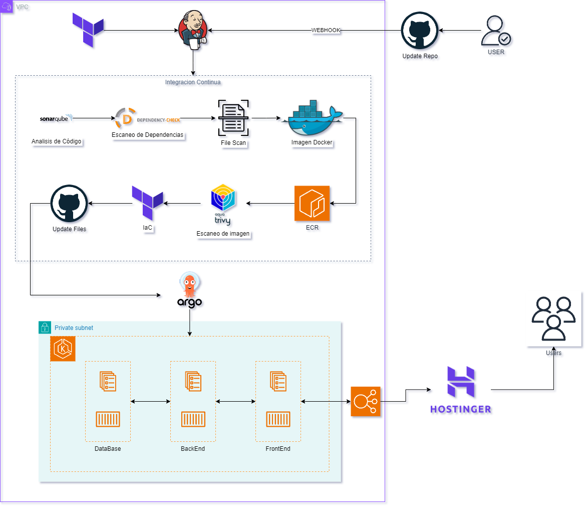

### Proyecto Final: Todo-List App con Enfoque DevOps

#### Arquitectura planeada

#### Descripción del Proyecto
El proyecto consiste en una aplicación tipo Todo-List utilizando tecnologías modernas de desarrollo web y operaciones de infraestructura, con un enfoque específico en DevOps. La aplicación estará compuesta por un backend Node.js con Express y una base de datos MySQL. Utilizaremos herramientas como Terraform para la infraestructura como código (IaC), CI/CD para automatización del flujo de trabajo, contenedores Docker para la portabilidad y Kubernetes para la orquestación de contenedores. Además, se incorporarán prácticas de observabilidad para garantizar la monitorización y la resolución proactiva de problemas.
#### Componentes del Proyecto

1. **Aplicación Todo-List:**
   - Desarrollar una aplicación web simple utilizando Node.js [18] y Express para el backend.
   - Usar npm
   - La aplicación permitirá a los usuarios crear, leer, actualizar y eliminar tareas de una lista.
   - Se integrará con una base de datos MySQL para almacenar las tareas.
   - Nombre de la bases de datos: todos

#### Objetivos DevOps:
El objetivo principal es implementar un flujo de trabajo DevOps completo para el proyecto Avatares. Esto incluye:

1. **Infraestructura como Código (IaC) con Terraform:**
   - Utilizar Terraform para definir y aprovisionar la infraestructura necesaria, como servidores, cluster, redes, bases de datos, etc.
   - Usar AWS ó Localstack

2. **Continuous Integration / Continuous Deployment (CI/CD):**
   - Configurar un pipeline de CI/CD utilizando herramientas como Jenkins, GitLab CI, o GitHub Actions.
   - Implementar despliegues automatizados del backend y frontend en entornos de desarrollo y producción.

3. **Contenedores:**
   - Utilizar contenedores Docker para empaquetar y distribuir la aplicación backend y frontend, junto con todas sus dependencias.
   - Definir Dockerfiles para construir imágenes de contenedor optimizadas y seguras.
   - Utilizar Docker Compose para orquestar contenedores en entornos locales de desarrollo y pruebas.
   - Subir las imagenes al Registry de Docker-Hub

4. **Orquestación de Contenedores con Kubernetes:**
   - Implementar Kubernetes para orquestar y administrar los contenedores en un entorno de producción.
   - Definir y desplegar manifestos de Kubernetes (archivos YAML) para desplegar y escalar la aplicación en clústeres de Kubernetes.
   - Pueden usar Minikube/k3s/K0s/Killercoda/AWS-EKS

5. **Observabilidad:**
   - Implementar herramientas de observabilidad como Prometheus para la recopilación de métricas, Grafana para la visualización de métricas.
   - Configurar paneles de control en Grafana para monitorear el rendimiento de la aplicación, la utilización de recursos y la salud del clúster de Kubernetes.

6. **Buenas Prácticas:**
   - Aplicar prácticas de seguridad.
   - Certificados, proxys etc
   - Implementar estrategias de gestión de configuración para mantener la configuración de la aplicación separada del código fuente.
   - Utilizar GitFlow para gestionar el flujo de código y versionado de la aplicación.

#### Entregables del Proyecto:
- Repositorio de código en un sistema de control de versiones como GitHub, GitLab o Bitbucket.
- Documentación detallada que describa la arquitectura del proyecto, la configuración de la infraestructura, los pasos de implementación de DevOps y las prácticas seguidas.
- Pipeline de CI/CD configurado y funcionando para el despliegues.
- Infraestructura aprovisionada y administrada mediante Terraform.
- Aplicación desplegada y ejecutándose correctamente en un clúster de Kubernetes.
- Herramientas de observabilidad configuradas y proporcionando información útil sobre el estado y rendimiento de la aplicación.

